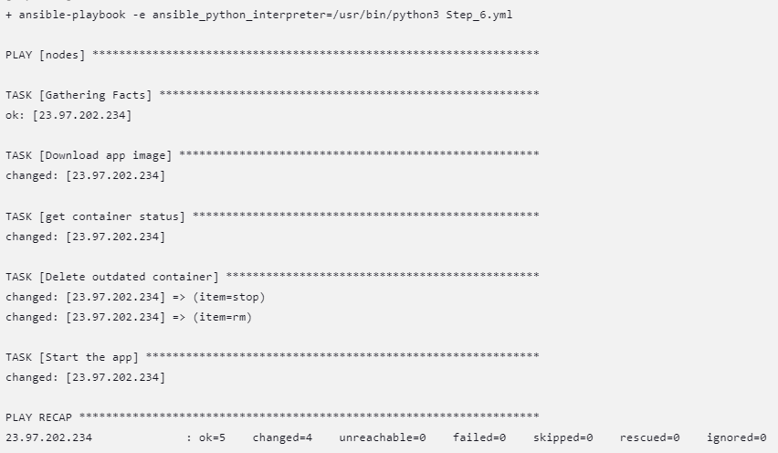

# Ansible-Playbook

## VM_config_playbook

In this stage of the project we use the first Playbook "VM_config_playbook" on our VM in order to initialize and 
download the necessary tools for the next steps.

### Tools like :

- Docker
- Python
- Apt

## Step_6
In the next stage we configurate a pipeline thats uses the second playbook "Step_6" which does the following things.

### Steps : 
- Downloads the latest image of our toDoAppWithLogin from dockerhub.
- Checks if a container is already up and running with the outdated image.
- If another container is active it shuts it down, removes it from the docker files and initializes a new container with the latest image.

